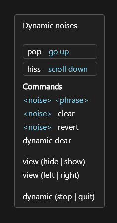

# Dynamic Noises

This is an experimental repository. WIP.

Dynamic noises allow you to update noises "pop" and "hiss" on the fly, individually, or as a group.

## Tester
Say "dynamic noises" to try it out. A UI will show you your current phrase binding.



## For context usage
```python
dynamic_noises = {
    "default": {
        "pop": ("jump", lambda: actions.key("space")),
        "hiss": ("scroll down", actions.mouse_scroll),
    },
    "repeater": {
        "pop": ("repeat", actions.core.repeat_phrase),
        "hiss": lambda: print("hiss"),
    },
}

@ctx.action_class("user")
class Actions:
    def dynamic_noises():
        return dynamic_noises

# Enable
actions.user.dynamic_noises_enable()

# Disable
actions.user.dynamic_noises_disable()
```

This sets us up with two modes, "default" and "repeater". If we speak the words "default" or "repeater", we get the corresponding mode.

## Setting individual noise
We can set an individual noise to a function using. It must have a name.
```py
actions.user.dynamic_noises_set("pop", ("repeat", actions.core.repeat_phrase))
```

## Setting mode
We can choose a mode from above by using
```py
actions.user.dynamic_noises_set_mode("repeater")
```

## Actions
| Action | Description |
| --- | --- |
| `user.dynamic_noises` | Define all your noise bindings conveniently in a ctx action with a dict. |
| `user.dynamic_noises_disable` | Disable dynamic noises. Restores Talon noises if applicable and stops listening for phrase binding. |
| `user.dynamic_noises_enable` | Enable dynamic noises. Replaces Talon noises with dynamic noises. `dynamic_noises_set` will now work, and phrases like "pop go down" or "hiss again" will bind actions. |
| `user.dynamic_noises_event_register` | Register a listener to respond to dynamic action state changes. |
| `user.dynamic_noises_event_unregister` | Unregister a listener for a dynamic action. |
| `user.dynamic_noises_event_unregister_all` | Unregister all listeners for dynamic actions. |
| `user.dynamic_noises_reset` | Reset all dynamic noises to their default state. |
| `user.dynamic_noises_set` | Primary action for assigning a dynamic action to a noise. By default, "pop" and "hiss" use Talon noises unless overridden. |
| `user.dynamic_noises_set_hiss` | Convenience wrapper around `dynamic_noises_set`. Assigns a dynamic action to "hiss". |
| `user.dynamic_noises_set_mode` | Sets the mode (group of bindings) for dynamic noises, as configured by the user. |
| `user.dynamic_noises_set_pop` | Convenience wrapper around `dynamic_noises_set`. Assigns a dynamic action to "pop". |
| `user.dynamic_noises_special_action` | For use with list user.dynamic_noises_special_action, such as clear, revert |
| `user.dynamic_noises_tester_toggle` | Toggles the dynamic noise tester on or off. |
| `user.dynamic_noises_tester_ui_position` | Adjust the UI position of the dynamic noise tester. |
| `user.dynamic_noises_trigger` | Manually trigger a dynamic action, useful when using parrot instead of talon noises for example |
| `user.dynamic_noises_ui_element` | UI element built from `ui_elements` to display the current dynamic actions for "pop" and "hiss". |

## Information
While enabled:
- Default talon pop and hiss replaced with ctx dynamic versions
- Speech recognition will listen for "pop" and "hiss" at the beginning of a phrase and bind whatever comes after it.
- We can also update individual noises using actions `actions.user.dynamic_noises_set_pop` and `actions.user.dynamic_noises_set_hiss`

This looks like:
```python
actions.user.dynamic_noises_set_pop("repeater", actions.core.repeat_phrase)
```

## No speech binding
- If you don't want to use speech binding, you can set the option when enabling dynamic noises.
```python
actions.user.dynamic_noises_enable(speech_capture=False)
```

## For parrot instead of talon noises
Recommend checking out package `roku_talon_shared/parrot_config` instead.

However if you want to use this, you may need to add your override ctx for your default parrot noises in `src/dynamic_noises_talon_override.py`. And then enable dynamic noises like so:
```python
actions.user.dynamic_noises_enable(talon_noises=False)
```

## Dependencies
`ui_elements` for displaying `dynamic_noises_ui_element`.

## Manifest
See `manifest.json` for details.